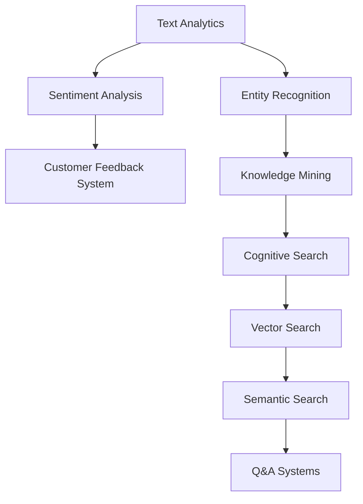

# Scaling AI Engineer Learning Journey: Organization Strategy

## Challenge
- 130+ Azure AI learning modules
- Need to organize for easy retrieval and replication
- Goal: Future AI can analyze learnings and recommend Azure features based on solution needs

## Proposed Structure

### 1. Hierarchical Knowledge Base

```
AI_ENGINEER_KNOWLEDGE_BASE/
├── 01_FOUNDATIONS/
│   ├── cognitive_services_basics/
│   ├── azure_ml_fundamentals/
│   └── ai_ethics_compliance/
├── 02_VISION/
│   ├── computer_vision/
│   ├── custom_vision/
│   ├── form_recognizer/
│   └── video_analyzer/
├── 03_LANGUAGE/
│   ├── text_analytics/
│   ├── translator/
│   ├── language_understanding/
│   └── question_answering/
├── 04_SPEECH/
│   ├── speech_to_text/
│   ├── text_to_speech/
│   └── speech_translation/
├── 05_SEARCH/
│   ├── cognitive_search/
│   ├── vector_search/
│   ├── semantic_search/
│   └── knowledge_mining/
├── 06_DECISION/
│   ├── anomaly_detector/
│   ├── personalizer/
│   └── content_moderator/
├── 07_OPENAI/
│   ├── azure_openai_basics/
│   ├── prompt_engineering/
│   ├── fine_tuning/
│   └── responsible_ai/
└── 08_MLOPS/
    ├── ml_pipelines/
    ├── model_deployment/
    └── monitoring/
```

### 2. Standardized Lab Documentation Template

```markdown
# Lab [Number]: [Title]

## Metadata
- **Category**: [Vision/Language/Search/etc]
- **Difficulty**: [Beginner/Intermediate/Advanced]
- **Time**: [Estimated hours]
- **Prerequisites**: [List of required knowledge]
- **Azure Services**: [List all services used]
- **Cost Estimate**: [Free tier/Paid features needed]

## Business Scenarios
- [When would you use this in real world]
- [Problem it solves]
- [Industry applications]

## Technical Summary
### What It Does
[One paragraph explanation]

### Key Features
- Feature 1: [Description]
- Feature 2: [Description]

### Architecture Pattern
[Simple diagram or ASCII art]

## Implementation
### Quick Start
```bash
# Minimal commands to get running
```

### Configuration
```json
{
  "key_settings": "values"
}
```

### Code Snippets
```python
# Essential code pattern
```

## Results & Metrics
- Performance: [Speed/Accuracy]
- Cost: [Per transaction/month]
- Limitations: [What it can't do]

## Learnings & Gotchas
### What Worked
- [Success patterns]

### What Failed
- [Common errors and solutions]

### Best Practices
- [Do this]
- [Don't do that]

## Integration Points
- **Combines Well With**: [Other Azure services]
- **API Compatibility**: [REST/SDK/CLI]
- **Export Formats**: [JSON/CSV/etc]

## Tags
#azure #ai #[specific-service] #[use-case]
```

### 3. Searchable Knowledge Index

Create a master index file:

```json
{
  "labs": [
    {
      "id": "lab-001",
      "title": "Azure AI Services Containers",
      "category": "foundations",
      "services": ["cognitive-services", "docker"],
      "use_cases": ["offline-ai", "edge-computing", "data-privacy"],
      "difficulty": "intermediate",
      "key_learning": "Run AI models offline in containers",
      "business_value": "Enable AI in secure/offline environments"
    },
    {
      "id": "lab-010",
      "title": "Vector Search",
      "category": "search",
      "services": ["cognitive-search", "embeddings"],
      "use_cases": ["semantic-search", "recommendation", "similarity"],
      "difficulty": "advanced",
      "key_learning": "Find content by meaning not keywords",
      "business_value": "Better search experiences"
    }
  ]
}
```

### 4. AI-Queryable Summary Format

For each module, create an AI-friendly summary:

```yaml
lab_id: vector-search-001
problem_solved: "Finding semantically similar content without keyword matches"
when_to_use:
  - "E-commerce product discovery"
  - "Support ticket routing"
  - "Content recommendation"
  - "Knowledge base search"
technical_requirements:
  - "Azure Cognitive Search (Basic+ tier for full features)"
  - "Pre-computed embeddings (1536 dimensions)"
  - "Vector index configuration"
implementation_effort: "2-4 hours"
ongoing_costs: "$75/month Basic tier"
combines_with:
  - "Azure OpenAI for embedding generation"
  - "Cognitive Services for text processing"
gotchas:
  - "API version sensitivity (use 2024-07-01+)"
  - "Free tier supports vectors but not semantic ranker"
code_pattern: |
  vectorQueries: [{
    vector: embedding_array,
    fields: "vectorField",
    k: 5
  }]
```

### 5. Automated Knowledge Extraction

Create scripts to extract patterns:

```python
# knowledge_extractor.py
import os
import json
import re

def extract_azure_services(content):
    """Extract Azure service mentions from lab content"""
    services = re.findall(r'Azure\s+[\w\s]+(?:Service|Search|AI|ML)', content)
    return list(set(services))

def extract_code_patterns(content):
    """Extract reusable code snippets"""
    code_blocks = re.findall(r'```[\w]*\n(.*?)\n```', content, re.DOTALL)
    return code_blocks

def categorize_by_use_case(content):
    """Categorize labs by business use case"""
    use_cases = {
        'search': ['search', 'find', 'query', 'discover'],
        'vision': ['image', 'video', 'visual', 'OCR'],
        'language': ['text', 'translate', 'sentiment', 'NLP'],
        'prediction': ['forecast', 'predict', 'anomaly', 'pattern']
    }
    # Implementation...
```

### 6. Future AI Integration Strategy

Enable future AI to query your knowledge:

```python
# Example: "I need to build a customer support chatbot with search capabilities"

def recommend_azure_stack(requirements):
    """
    AI analyzes requirements and suggests Azure services
    based on learned patterns from 130+ labs
    """
    suggestions = {
        "primary_services": [
            {
                "service": "Azure OpenAI",
                "reason": "Natural language understanding",
                "lab_reference": "lab-045"
            },
            {
                "service": "Cognitive Search + Vector Search",
                "reason": "Semantic search in knowledge base",
                "lab_reference": "lab-010"
            }
        ],
        "supporting_services": [
            "Azure Functions for API",
            "Cosmos DB for conversation history"
        ],
        "estimated_cost": "$200-500/month",
        "implementation_complexity": "Medium",
        "similar_implementations": ["lab-067", "lab-089"]
    }
    return suggestions
```

### 7. Knowledge Graph Approach

Create relationships between labs:



## Implementation Plan

### Phase 1: Organize Existing Labs (Week 1)
1. Create folder structure
2. Migrate current labs to new format
3. Add metadata to each lab

### Phase 2: Build Index System (Week 2)
1. Create JSON index of all labs
2. Add tags and categories
3. Build search functionality

### Phase 3: Extract Patterns (Week 3)
1. Run extraction scripts
2. Identify common patterns
3. Create reusable templates

### Phase 4: AI Integration Prep (Week 4)
1. Create AI-queryable summaries
2. Build recommendation engine
3. Test with sample queries

## Benefits

1. **Discoverability**: Find relevant labs by problem, not just by name
2. **Reusability**: Copy proven patterns quickly
3. **AI-Ready**: Future AI can analyze and recommend
4. **Cost Awareness**: Know pricing before implementing
5. **Time Savings**: Estimate effort upfront
6. **Best Practices**: Learn from past successes/failures

## Example Query Scenarios

```
"I need offline AI for a hospital" 
→ Returns: Container labs, HIPAA compliance, edge computing

"Customer wants semantic search"
→ Returns: Vector search, cognitive search, OpenAI embeddings

"Build a document processing pipeline"
→ Returns: Form Recognizer, OCR, Cognitive Search, Logic Apps
```

This structure scales to 1000+ labs while remaining searchable and AI-analyzable!